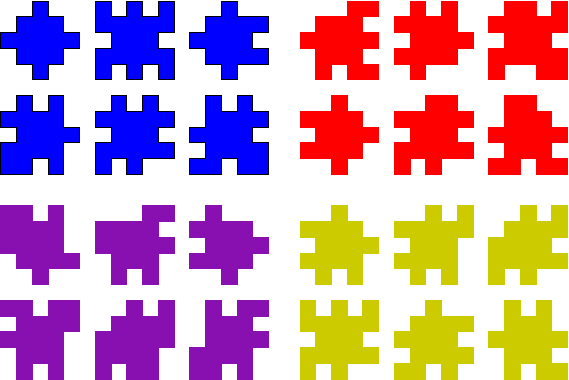
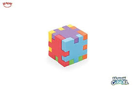

# Happy Cube solution finder

#### Common Information
It is a program for finding puzzle solution.
It uses the brute force for finding the combinations and positions of pieces. 
The initial test sets: 
 

The assembled cube looks like:

The algorithm: 
1. Finds the variants of positions for every piece. Position is a result of piece rotating/mirroring (e.g. blue 1 has 1 position, blue 3 has 4 position, blue 4 has 8 position )

2. Then it finds the Cartesian Product using sets of 6 pieces.

3. Then it finds all permutations for every product and fold it into cube and checks whether it perfect. Result is written to solution file. 

The algorithm has few optimizations, like a early (faster) detection that cube is not perfect, permutations finding is run in parallel. 
The program does not check whether solution is unique, but I have some thoughts how to implement it.  

##### The input params for running program:

java  -jar ./target/happycube-spring-boot.jar "dir with input data" "prefix for input files" "extention of input files" "solutions dir" "solutions files prefix" "solutions files extension" "need to stop after first solution is found true/false" 
